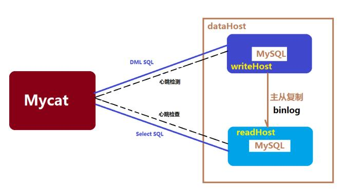

# 数据库架构设计

最近学习数据库分库分表架构设计的笔记，前半篇是理论基础，后半篇是实操，水平有限，仅作交流。

##1、海量存储问题

### 1.1、数据库的演变

​	关系型数据库—非关系型数据库NoSql—分布式数据库

​	关系型数据库通过外键关联来建立表与表之间的关系，优势在于支持事务，能够==保证数据的一致性和安全性==，此外==能够用Sql语句在多个表之间进行复杂的数据查询==。但是其数据存储在硬盘中，数据量级增大之后，==查询速度会非常慢==。适合处理量级不大且安全性高的数据，例如银行转账等和支付相关的数据。因而就出现了非关系型数据库NoSql。

​	Nosql中数据以对象的形式存储在数据库中，对象之间的关系通过每个对象自身的属性来决定。并且将==数据存储在缓存中==，基于键值对的存储形式，只能通过键的完全一致查询获取数据 ，查询速度大大提升，而且数据之间没有耦合性，==不支持复杂查询。安全性要求不高==。==处理海量数据==也十分轻松，例如微博数据等等。它通过**降低数据的安全性，减少对事务的支持，减少对复杂查询的支持，来获取性能上的提升**。 

​	虽然在云计算时代，传统数据库存在着先天性的弊端，但是NoSQL数据库又无法将其替代NoSQL只能作为传统数据的补充而不能将其替代，所以规避传统数据库的缺点是目前大数据时代必须要解决的问题

### 1.2、什么是分库分表

​	在现在高并发、高性能的互联网项目中，数据的量级由GB到PB到TB，对数据操作的难度越来越大。有些使用场景是需要有事务与安全指标的。NoSQL已经无法满足要求，还是需要使用关系性数据库。要使用关系型数据库解决海量存储的问题。主要是解决两个问题，

- 1、如何存储海量数据？

- 2、单表数据量达到千万级，如何提升查询性能？


​        主流解决方案是==数据拆分==。首先第一个问题，当数据库实例的吞吐量达到性能瓶颈的时候，我们可以增==加数据库实例（分库）==，让每个数据库实例承担其中一部分数据库的请求，分解总体的大请求量带来的压力。第二个问题，在单表数据量达到极限的时候（Mysql 存储5000万条记录后性能会越来越差），我们可以分表，==分解单表的大数据量==对索引查询的压力，方便对索引和表结构的变更。

##2、数据库的分片

​	就是指通过某种特定的条件，将存放在同一个数据库中的数据分散存放到多个数据库（主机）上面，以达到分散单台设备负载的效果。 

数据库拆分**解决方案**：**分库分表**

数据库使用的三个阶段：单库单表——单库多表——多库多表





### 2.1、数据的切片方式

​	主要有两种：**垂直切分（分布式）**和**水平切分（集群）**

- 垂直切分：一个数据库中存储多张表，每个表对应不同的业务，按业务对表进行分类，将其分布到不同的数据库上。同样在单表中，也可以根据字段的活跃程度进行拆分，实现数据的冷热分离。

  

- 水平切分：按表的数据行进行切分（**数据的逻辑关系** ），将数据记录分散到多个库表中，以保证单表记录数不会太大。拆分之后的表结构完全一样。（路由过程与分片维度）

​        举例：以User表为例，当同时有100万用户在浏览的时候，单表会进行100万次请求，则单个数据库会承受100万次请求压力。但如果将其拆分成100张表，分布到10个数据库中，每张表进行1万次请求，则每个数据库承受10万次请求压力。这样分库分表之后，数据库压力就会成倍减少。

​	在数据库表中，字段变化频率是有区别的，变化频率低、查询次数多的为冷数据，变化频率高的为活数据。对表中某些冷数据，我们可以将其放在查询性能很高的数据库硬件上。对于活跃数据，我们则可以将其放在更新性能较高的数据库硬件上。从而实现**冷热分离**，提升数据库性能。

​	拆分数据就需要定义分片规则，比较常见的又哈希切片和按时间切片等。在互联网项目中，这两种切片方式一般同时存在。

### 2.2、如何实现分片？

​	当数据库分片后，数据由一个数据库分散到多个数据库中。系统要查询时需要切换不同的数据库进行查询，那么系统如何知道要查询的数据在哪个数据库中？当插入记录时要向哪个数据库中插入呢？ 一般有三大类实现方案：**客户端分片**、**代理分片**、**支持事务的分布式数据库**。这里我们主要研究代理分片。

​	代理分片就是在应用层和数据库层增加一个代理层，把分片的路由规则配置在代理层，代理层向外提供与JDBC兼容的接口给应用层。**开发人员**无需关注分片规则，**只需关注业务逻辑的实现，把分库分表的配置交给代理层做**。开发的时候与操作单表单库没什么区别。这样做**增加了代理层，而且必须要实现对JDBC协议的解析，并通过分片的路由规则来路由请求，对每个数据库操作都增加了一层网络传输，会损失一定的性能**。通过代理分片实现的框架有国产开源中间件Mycat和阿里的Cobar。（Ps:Mycat一直想加入Apache开源项目中，无奈...）

### 2.3、数据库的读写分离

​	在实际互联网项目的场景中，对数据库的读操作是远远大于写操作的，基于这个问题，可以对其操作进行读写分离。读写分离的实质也是做==数据库集群==，在高并发情况下，**将对数据库的读写操作分配到多个数据库服务器上，从而降低单台数据库的访问压力**。读写分离一般通过配置主从数据库的方式（一主多从），主库从库结构完全一样（主从复制，高可用），一个主库（Master）可以有多个从库（Slave），一个从库下面还可以挂从库。并且所有写操作必须必须对应到主库（**主库挂掉集群挂掉**），然后异步更新到从库（**==延迟问题==**），这样可以显著提高数据库集群的吞吐量。


​	常见读写分离方案：

- ​	Mysql提供的解决方案：使用binlog进行数据库同步，需要手动配置mysql。
	 ​	在代码中实现读写分类： 1、可以使用aop实现一个切面。动态切换数据源，需要编程实现。  2、使用数据库中间件实现读写分类，分库分表，如Mycat、Cobar。

### 2.4、分片引发问题

略。

## 3、Mycat介绍及配置

### 3.1Mycat简介

​	Maycat是一个开源的分布式数据库系统，也是一个新颖的数据库中间件产品，介于数据库与应用之间，进行数据处理与交互的中间服务。它来源于Cobar，实现了Mysql、JDBC协议，支持mysql集群（mariadb cluster），其核心功能是分表分库，提供高可用性数据分片集群。所以Mycat还支持Oracle、SQLServer、PostgreSQL、mongoDB等主流数据库。其分片策略如下图。


- 逻辑库（**shceme**）:开发人员在开发的时候无需关注代理层的实现及存在，所以数据库中间件可以被看做是一个或多个数据库集群构成的逻辑库。 
- 逻辑表（**table**）:在分布式数据库中，对应用来说，读写数据的表就是逻辑表。逻辑表，可以是数据切分后，分布在一个或多个分片库中，叫做分片表，也可以不做数据切分，不分片，只有一个表构成，叫做非分片表。
- 分片节点(**dataNode**)：数据切分后，一个大表被分到不同的分片数据库上面，每个表分片所在的数据库就是一个分片节点（dataNode）。
- 节点主机(**dataHost**) ：数据切分后，每个分片节点（dataNode）不一定都会独占一台机器，同一机器上面可以有多个分片数据库，这样一个或多个分片节点（dataNode）所在的机器就是节点主机（dataHost）,为了规避单节点主机并发数限制，尽量将读写压力高的分片节点（dataNode）均衡的放在不同的节点主机（dataHost）。
- 分片规则(rule) ：一个大表被分成若干个分片表，就需要一定的规则，这样按照某种业务规则把数据分到某个分片的规则就是分片规则，数据切分选择合适的分片规则非常重要，将极大的避免后续数据处理的难度。


### 3.2Mycat安装

#### 3.2.1 环境要求

```
Linux环境一致，主库从库mysql版本一致
jdk：要求jdk必须是1.7及以上版本
Mysql：推荐mysql是5.5以上版本
Mycat的官方网站：http://www.mycat.org.cn/
下载地址：https://github.com/MyCATApache/Mycat-download
```

#### 3.2.2安装

​	mysql在线安装安装：==`yum install mysql-community-server  `==    //别掉了-server，推荐安装

`yum install mysql-server  `

​	本地安装：`yum localinstall mysql-community-release-el6-5.noarch.rpm `  //不推荐，经常报unrecognized service错误

​	若是LINUX版本的MYSQL，则需要设置为Mysql大小写不敏感，否则可能会发生表找不到的问题。

在MySQL的配置文件中/etc/my.cnf [mysqld] 中增加一行：`lower_case_table_names=1`

```
启动：service mysqld start
状态：service mysqld status
停止：service mysqld stop
重启：service mysqld restart

解决MySQL登录ERROR 1045 (28000): Access denied for user 'root'@'localhost' (using passwor)问题
修改密码：
vim /etc/my.cnf   //并在[mysqld] 下面添加一句：skip-grant-tables 
service mysqld restart                //重启mysql并修改密码
mysql                                //运行mysql,进入控制台
use mysql;     
update user set Password = password('123456') where User = 'root';  //修改密码（改成自己的用户名密码）
flush privileges;   //刷新权限

//打开/etc/my.cnf,并删除之前往[mysqld] 里面添加的内容 
vim /etc/my.cnf 
//再次启动mysql就可以正常使用啦！
mysql -uroot -p123456

//开启远程授权
use mysql;
GRANT ALL PRIVILEGES ON *.* TO 'root'@'%' IDENTIFIED BY '123456' WITH GRANT OPTION;

//如果出现以下报错，原因是曾经升级过数据库，升级完后没有使用mysql_upgrade升级数据结构造成的。
ERROR 1558 (HY000): Column count of mysql.user is wrong. Expected 43, found 42. Created with MySQL 50549, now running 50640. Please use mysql_upgrade to fix this error.
//解决办法
mysql_upgrade -u root -p 123456
mysql -uroot -p123456
//再执行一遍上面的远程授权

//卸载
yum remove mysql
 yum remove mysql-server
 
 //删除数据库失败报错，解决办法清理数据库文件目录
 ERROR 1010 (HY000): Error dropping database (can't rmdir '.\db2', errno: 41) 删库失败问题的解决
 select @@datadir;
 quit;
 cd /var/lib/mysql
 rm -rf db2;
 
 //mysql远程连接报错：Lost connection to Mysql server at 'waiting for initial communication packet'
 报错原因看此博客：https://www.cnblogs.com/kevingrace/p/6196885.html

 vi /etc/my.cnf    //在my.cnf配置文件中的[mysqld]区域添加skip-name-resolve
```

​	Mycat有windows、linux多种版本。本教程为linux安装步骤，windows基本相同。下载Mycat-server-xxxx-linux.tar.gz，将压缩包解压缩。建议将mycat放到/usr/local/mycat目录下。

```

启动：bin/mycat start

停止：bin/mycat stop

查看状态：bin/mycat status

出现如图所示则启动成功

mycat 支持的命令{ console | start | stop | restart | status | dump } 
Mycat的默认端口号为：8066
```


#### 3.2.3配置分片

这里将Item表存储到三个节点为例，配置3个数据库节点和2个服务器节点。

两台mysql数据库服务器：Host1：192.168.26.133     Host2：192.168.25.132


**host1环境**

操作系统版本 : centos6.5

数据库版本 : mysql-5.6

mycat版本 ：1.4 release

数据库名 : db1、db3

MyCat安装到节点1上


**mysql节点2环境**

操作系统版本 : centos6.5

数据库版本 : mysql-5.6

mycat版本 ：1.4 release

数据库名 : db2


修改conf下的scheme.xml

```
	<schema name="eshop" checkSQLschema="false" sqlMaxLimit="100">
		<table name="tb_item" dataNode="dn1,dn2,dn3" rule="auto-sharding-long" />
	</schema>
	<!--数据库节点 -->
	<dataNode name="dn1" dataHost="localhost1" database="db1" />
	<dataNode name="dn2" dataHost="localhost2" database="db2" />
	<dataNode name="dn3" dataHost="localhost1" database="db3" />
	<!--服务器节点 -->
	<dataHost name="localhost1" maxCon="1000" minCon="10" balance="0"
		writeType="0" dbType="mysql" dbDriver="native" switchType="1"  slaveThreshold="100">
		<heartbeat>select user()</heartbeat>
		<writeHost host="hostM1" url="192.168.26.133:3306" user="root"
			password="123456">
		</writeHost>
	</dataHost>
	<dataHost name="localhost2" maxCon="1000" minCon="10" balance="0"
		writeType="0" dbType="mysql" dbDriver="native" switchType="1"  slaveThreshold="100">
		<heartbeat>select user()</heartbeat>
		<writeHost host="hostM1" url="192.168.26.132:3306" user="root"
			password="123456">
		</writeHost>
	<!-- <writeHost host="hostM2" url="localhost:3316" user="root" password="123456"/> -->
	</dataHost>
```

server.xml配置mycat连接账号

```
<user name="user">
		<property name="password">user</property>
		<property name="schemas">eshop</property>
</user>
```

启动mysql和mycat，查看log:`tail -f logs/mycat.log`出现以下log即说明节点初始化连接成功

```
07/02 20:39:03.838   INFO [$_NIOREACTOR-0-RW] (GetConnectionHandler.java:66) -connected successfuly MySQLConnection [id=19, lastTime=1530589143838, schema=db1, old shema=db1, borrowed=true, fromSlaveDB=false, threadId=20, charset=latin1, txIsolation=0, autocommit=true, attachment=null, respHandler=null, host=192.168.26.133, port=3306, statusSync=null, writeQueue=0, modifiedSQLExecuted=false]
07/02 20:39:03.931   INFO [WrapperSimpleAppMain] (PhysicalDBPool.java:301) -init result :finished 10 success 10 target count:10
07/02 20:39:03.932   INFO [WrapperSimpleAppMain] (PhysicalDBPool.java:243) -localhost1 index:0 init success
07/02 20:39:15.433   INFO [$_NIOREACTOR-0-RW] (FrontendAuthenticator.java:164) -ServerConnection [id=1, schema=null, host=192.168.26.1, user=user,txIsolation=3, autocommit=true, schema=null]'user' login success
07/02 20:41:58.186   INFO [$_NIOREACTOR-0-RW] (FrontendAuthenticator.java:164) -ServerConnection [id=2, schema=null, host=192.168.26.1, user=user,txIsolation=3, autocommit=true, schema=null]'user' login success
```

​	我当时在配置的时候出现以下报错，检查mycat配置，mysql远程连接都没问题，查看log，发现==NoRouteToHostException  找不到主机路由错误==，只想起来主库虚拟机是仅主机模式，从库虚拟机是NAT模式，是无法进行通信的，重新虚拟网络设置，两台都在NAT模式下，解决此问题。

### 3.3 、Mycat分片测试

在mycat下**use eshop；**并创建表，此时发现主库从库db1、db2、db3数据库下均出现tb_item表。

```
DROP TABLE IF EXISTS `tb_item`;
CREATE TABLE `tb_item` (
  `id` bigint(20) NOT NULL COMMENT '商品id，同时也是商品编号',
  `title` varchar(100) NOT NULL COMMENT '商品标题',
  `sell_point` varchar(500) DEFAULT NULL COMMENT '商品卖点',
  `price` bigint(20) NOT NULL COMMENT '商品价格，单位为：分',
  `num` int(10) NOT NULL COMMENT '库存数量',
  `barcode` varchar(30) DEFAULT NULL COMMENT '商品条形码',
  `image` varchar(500) DEFAULT NULL COMMENT '商品图片',
  `cid` bigint(10) NOT NULL COMMENT '所属类目，叶子类目',
  `status` tinyint(4) NOT NULL DEFAULT '1' COMMENT '商品状态，1-正常，2-下架，3-删除',
  `created` datetime NOT NULL COMMENT '创建时间',
  `updated` datetime NOT NULL COMMENT '更新时间',
  PRIMARY KEY (`id`),
  KEY `cid` (`cid`),
  KEY `status` (`status`),
  KEY `updated` (`updated`)
) ENGINE=InnoDB DEFAULT CHARSET=utf8 COMMENT='商品表';
```

​	继续插入数据，发现所有数据全部插入db1库，这是由于配置的分片规则为“auto-sharding-long”，所以mycat会根据此规则自动分片，每个datanode中保存一定数量的数据。根据id进行分片

```
经测试id范围为：
Datanode1：1~5000000
Datanode2：5000000~10000000
Datanode3：10000001~15000000

当15000000以上的id插入时报错：
[Err] 1064 - can't find any valid datanode :TB_ITEM -> ID -> 15000001
此时需要添加节点了。
继续插入id为6000001的数据可发现此条记录插入db2,与预想一致。
```


## 4、Mycat高可用方案

​	数据库读写分离对于大型系统或者访问量很高的互联网应用来说，是必不可少的一个重要功能。对于MySQL来说，标准的读写分离是主从模式，一个写节点Master后面跟着多个读节点，读节点的数量取决于系统的压力，通常是1-3个读节点的配置 ，Mycat读写分离和自动切换 ，需要mysql的主从复制机制配合。 

### 4.1、主从复制+读写分离


```
Slave_SQL_Running: No
1.程序可能在slave上进行了写操作
2.也可能是slave机器重起后，事务回滚造成的.

一般是事务回滚造成的：
解决办法：
mysql> slave stop;
mysql> set GLOBAL SQL_SLAVE_SKIP_COUNTER=1;
mysql> slave start;
```

## 4.2配置

####4. 2.1、Mysql主服务器配置

第一步：修改my.conf文件，在[mysqld]段下添加：
```
binlog-do-db=db1
binlog-ignore-db=mysql
# 启用二进制日志
log-bin=mysql-bin
# 服务器唯一ID，一般取IP最后一段
server-id=133
```


第二步：重启mysql服务：`service mysqld restart`

第三步：建立帐户并授权slave，

```
mysql>GRANT FILE ON *.* TO 'backup'@'%' IDENTIFIED BY '123456';

mysql>GRANT REPLICATION SLAVE, REPLICATION CLIENT ON *.* to 'backup'@'%' identified by '123456'; 

//刷新权限
mysql> FLUSH PRIVILEGES;

//查看mysql现在有哪些用户
mysql>select user,host from mysql.user;

//第四步：查询master的状态(注意记住position和Binlog字段)
mysql> show master status;
```

\#一般不用root帐号，“%”表示所有客户端都可能连，只要帐号，密码正确，此处可用具体客户端IP代替，如192.168.145.226，加强安全。

+------------------+----------+--------------+------------------+-------------------+

| File             | Position | Binlog_Do_DB | Binlog_Ignore_DB | Executed_Gtid_Set |

+------------------+----------+--------------+------------------+-------------------+

| mysql-bin.000001 |      120 | db1          | mysql            |                   |

+------------------+----------+--------------+------------------+-------------------+

1 row in set


 

 

#### 4. 2.2、Mysql从服务器配置

第一步：修改my.conf文件在[mysqld]下添加：`server-id=166`

第二步：配置从服务器。注意语句中间不要断开，master_port为mysql服务器端口号(无引号)，master_user为执行同步操作的数据库账户，“120”无单引号(此处的120就是show master status 中看到的position的值，这里的mysql-bin.000001就是file对应的值)。

```
mysql>change master to master_host='192.168.26.133',master_port=3306,master_user='backup',master_password='123456',master_log_file='mysql-bin.000001',master_log_pos=120；
```

第二步：启动从服务器复制功能

`Mysql>start slave;` 

第三步：检查从服务器复制功能状态：

`mysql> show slave status`


注：Slave_IO及Slave_SQL进程必须正常运行，即YES状态，否则都是错误的状态(如：其中一个NO均属错误)。

| 错误处理：   如果出现此错误：   Fatal error: The slave I/O thread stops   because master and slave have equal MySQL server UUIDs; these UUIDs must be   different for replication to work.   因为是mysql是克隆的系统所以mysql的uuid是一样的，所以需要修改。   解决方法：   删除/var/lib/mysql/auto.cnf文件，重新启动服务。 |
| :----------------------------------------------------------- |
|                                                              |


 

#### 4.2.3、Mycat配置

Mycat 1.4 支持MySQL主从复制状态绑定的读写分离机制，让读更加安全可靠。

下次再说。

