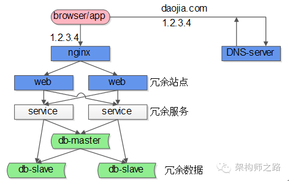
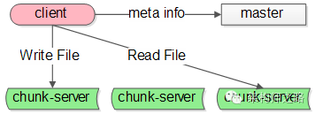
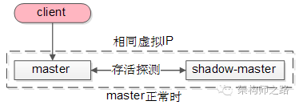
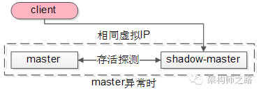
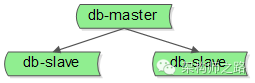
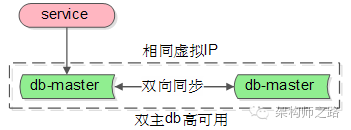
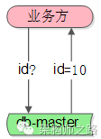

# 单点系统架构的可用性与性能优化

作者： 58沈剑

## 一、需求缘起

明明架构要求高可用，为何系统中还会存在单点？

回答：单点master的设计，会**大大简化系统设计，何况有时候避免不了单点**

典型互联网高可用架构

 

典型互联网高可用架构：

客户端层

 

负载均衡层

 

站点层

 

服务层

 

（5）**数据层**，包含cache和db，典型的是主从复制读写分离的db架构

在这个互联网架构中，站点层、服务层、数据库的从库都可以通过冗余的方式来保证高可用，但至少

nginx层是一个潜在的单点

 

写库master也是一个潜在的单点

 

 

 

GFS的系统架构里主要有这么几种角色：

client

 

master

 

（3）**chunk-server**，实际存储文件额服务器

这个系统里，master也是一个单点的服务，Map-reduce系统里也有类似的全局协调的master单点角色。

 

 

 

## 二、单点架构存在的问题

单点系统一般来说存在两个很大的问题：

非高可用

 

性能瓶颈

 

 

 

 

## 三、shadow-master解决单点高可用问题

shadow-master是一种很常见的解决单点高可用问题的技术方案。

**“影子master”，顾名思义，服务正常时，它只是单点master的一个影子，在master出现故障时，shadow-master会自动变成master，继续提供服务。**

shadow-master它能够解决高可用的问题，并且故障的转移是自动的，不需要人工介入，但不足是它使服务资源的利用率降为了50%，**业内经常使用keepalived+vip的方式实现这类单点的高可用**。

以GFS的master为例，master正常时：

 

 

 

 

当发现master异常时：

这个过程对调用方是透明的

 

 

 

传统的一主多从，读写分离的db架构，只能保证读库的高可用，是无法保证写库的高可用的，要想保证写库的高可用，也可以使用上述的shadow-master机制：

（1）两个主库设置**相互同步的双主模式**

 

（3）异常时，虚IP漂移到另一个主库，shadow-master变成主库继续提供服务

需要说明的是，由于数据库的特殊性，数据同步需要时延，如果数据还没有同步完成，流量就切到了shadow-master，可能引起小部分数据的不一致。

 

## 四、减少与单点的交互，是存在单点的系统优化的核心方向

既然知道单点存在性能上限，单点的性能（例如GFS中的master）有可能成为系统的瓶颈，那么，减少与单点的交互，便成了存在单点的系统优化的核心方向。

怎么来减少与单点的交互，这里提两种常见的方法。

**批量写**

批量写是一种常见的提升单点性能的方式。

例如一个利用数据库写单点生成做“ID生成器”的例子：

（1）业务方需要ID

（2）利用数据库写单点的auto increament id来生成和返回ID

这是一个很常见的例子，很多公司也就是这么生成ID的，它利用了数据库写单点的特性，方便快捷，无额外开发成本，是一个非常帅气的方案。

潜在的问题是：生成ID的并发上限，取决于单点数据库的写性能上限。

如何提升性能呢？批量写

（3）服务直接返回100个id中的1个，100个分配完，再访问数据库

这样一来，每分配100个才会写数据库一次，分配id的性能可以认为提升了100倍。

**客户端缓存**

客户端缓存也是一种降低与单点交互次数，提升系统整体性能的方法。

还是以GFS文件系统为例： 

## 五、水平扩展是提升单点系统性能的好方案

无论怎么批量写，客户端缓存，单点毕竟是单机，还是有性能上限的。

想方设法水平扩展，消除系统单点，理论上才能够无限的提升系统系统。

以nginx为例，如何来进行水平扩展呢？

“DNS轮询”技术

并不是所有的业务场景都可以水平拆分

## 六、总结

今天的话题就讨论到这里，内容很多，占用大家宝贵的时间深表内疚，估计大部分都记不住，至少记住这几个点吧：

单点系统存在的问题

可用性问题，性能瓶颈问题

shadow-master

减少与单点的交互

批量写，客户端缓存

（4）**水平扩展**也是提升单点系统性能的好方案