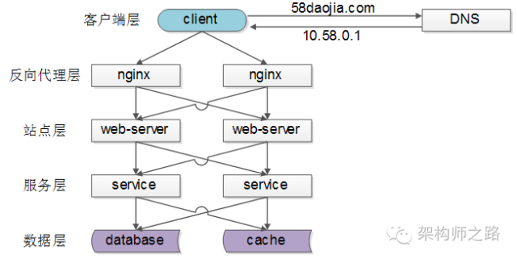
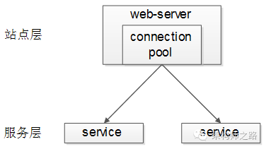
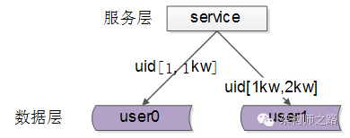
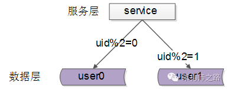

#### 1、负载均衡

 **什么是负载均衡**

负载均衡（Load Balance）是指将请求/数据**均匀分摊到多个操作单元上**执行，负载均衡的关键在于均匀。

##### **1、常见的负载均衡方案**

常见互联网分布式架构如上，分为**客户端层、反向代理nginx层、站点层、服务层、数据层**。可以看到，**每一个下游都有多个上游调用，只需要做到，每一个上游都均匀访问每一个下游**，就能实现“将请求/数据均匀分摊到多个操作单元上执行”。

##### **2、客户端层->反向代理层的负载均衡**

 

客户端层到反向代理层的负载均衡，是通过“DNS轮询”实现的：**DNS-server对于一个域名配置了多个解析ip，每次DNS解析请求来访问DNS-server，会轮询返回这些ip，保证每个ip的解析概率是相同的**。这些ip就是nginx的外网ip，以做到每台nginx的请求分配也是均衡的。

##### **3、反向代理层->站点层的负载均衡**

 

【反向代理层】到【站点层】的负载均衡，是通过“nginx”实现的。通过修改nginx.conf，可以实现**多种负载均衡策略**：

1）**请求轮询**：和DNS轮询类似，请求依次路由到各个web-server

2）**最少连接路由**：哪个web-server的连接少，路由到哪个web-server

3）**ip哈希**：按照访问用户的ip哈希值来路由web-server，只要用户的ip分布是均匀的，请求理论上也是均匀的，ip哈希均衡方法可以做到，同一个用户的请求固定落到同一台web-server上，此策略适合有状态服务，例如session（58沈剑备注：可以这么做，但强烈不建议这么做，站点层无状态是分布式架构设计的基本原则之一，session最好放到数据层存储）

4）…

##### 4、**站点层->服务层的负载均衡**

 

【站点层】到【服务层】的负载均衡，是通过“**服务连接池**”实现的。

上游连接池会建立与下游服务多个连接，每次请求会“随机”选取连接来访问下游服务。

 

##### 5、**数据层的负载均衡**

在数据量很大的情况下，由于数据层（db，cache）涉及数据的水平切分，所以数据层的负载均衡更为复杂一些，它分为“数据的均衡”，与“请求的均衡”。

**数据的均衡**是指：水平切分后的每个服务（db，cache），数据量是差不多的。

**请求的均衡**是指：水平切分后的每个服务（db，cache），请求量是差不多的。

业内常见的水平切分方式有这么几种：

一、按照range**水平切分**

 

每一个数据服务，存储一定范围的数据，上图为例：

user0服务，存储uid范围1-1kw

user1服务，存储uid范围1kw-2kw

这个方案的好处是：

（1）规则简单，service只需判断一下uid范围就能路由到对应的存储服务

（2）数据均衡性较好

（3）**比较容易扩展**，可以随时加一个uid[2kw,3kw]的数据服务

不足是：

（1）请求的负载不一定均衡，一般来说，**新注册的用户会比老用户更活跃**，大range的服务请求压力会更大

二、按照**id哈希水平切分**

 

每一个数据服务，存储某个key值hash后的部分数据，上图为例：user0服务，存储偶数uid数据user1服务，存储奇数uid数据

这个方案的好处是：

（1）规则简单，service只需对uid进行hash能路由到对应的存储服务

 （2）数据均衡性较好

（3）**请求均匀性较好**

不足是：（1）不容易扩展，扩展一个数据服务，hash方法改变时候，可能需要进行数据迁移

##### **总结**

------

负载均衡（Load Balance）是分布式系统架构设计中必须考虑的因素之一，它通常是指，将请求/数据【均匀】分摊到多个操作单元上执行，负载均衡的关键在于【均匀】。

**（1）【客户端层】到【反向代理层】的负载均衡，是通过“DNS轮询”实现的**

**（2）【反向代理层】到【站点层】的负载均衡，是通过“nginx”实现的**

**（3）【站点层】到【服务层】的负载均衡，是通过“服务连接池”实现的**

**（4）【数据层】的负载均衡，要考虑“数据的均衡”与“请求的均衡”两个点，常见的方式有“按照范围水平切分”与“hash水平切分”**

2、